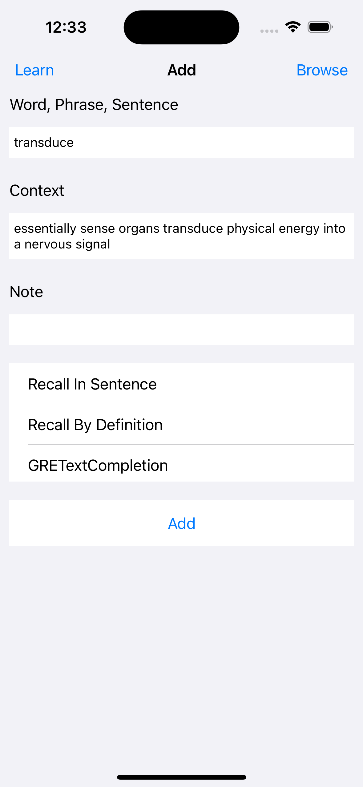
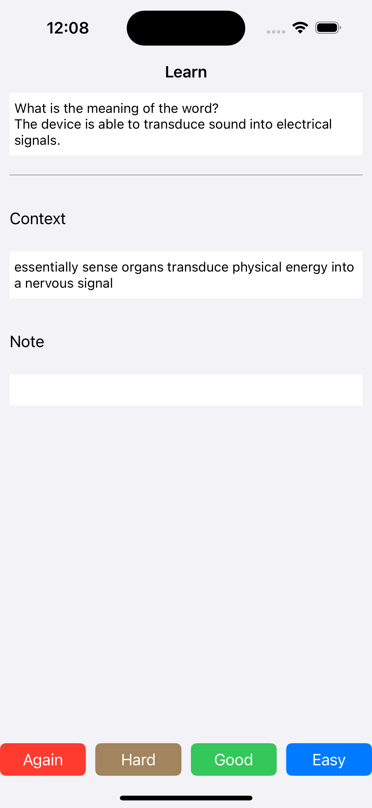
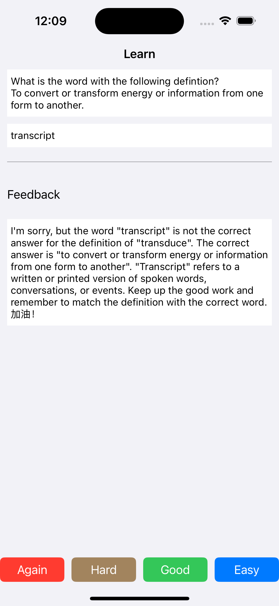

# ProsePro

**Note: The project is currently not being maintained. An Anki add-on is under development.** 

## Introduction
Knowledge of a new word, phrase, or sentence progresses through three stages: initially, we are unaware of its meaning; secondly, we learn its definition and can understand it in context; and thirdly, we are able to use it in our own writing. Traditional language learning apps, such as Anki, facilitate reaching the second stage by leveraging the spaced repetition algorithm. This is sufficient for comprehending reading and, possibly, listening if pronunciation is learned alongside the definition.

Achieving the third stage of mastery for writing requires learners to 1) use the word, phrase, or sentence grammatically and 2) consistently remember to use it appropriately. For instance, having learned "foster," one should remember to apply it in phrases like "foster one's skills" to convey "help develop," especially when writing about the responsibilities of schools.

To reach this stage, understanding the nuances of meaning in different contexts and practicing with quality feedback is crucial. The original spaced repetition system's fixed cards are suitable for memorizing facts—[a critical aspect intertwined with thinking and reasoning](https://www.wiley.com/en-us/Why+Don%27t+Students+Like+School%3F%3A+A+Cognitive+Scientist+Answers+Questions+About+How+the+Mind+Works+and+What+It+Means+for+the+Classroom%2C+2nd+Edition-p-9781119715665). However, to facilitate the transition from passive recognition to active usage, creating dynamic cards can help prevent reliance on recall of specific answers by promoting engagement with "language rules" and a deeper understanding of meanings in varying contexts.

Gwern also mentioned dynamic cards in his [introductory article](https://gwern.net/spaced-repetition#using-it): 

> With some NLP software, one could write dynamic flashcards which test all sorts of things: if one confuses verbs, the program could take a template like “`$PRONOUN $VERB $PARTICLE $OBJECT% {right: caresse, wrong: caresses}`” which yields flashcards like “Je caresses le chat” or “Tu caresse le chat” and one would have to decide whether it was the correct conjugation. (The dynamicism here would help prevent memorizing specific sentences rather than the underlying conjugation.) In full generality, this would probably be difficult, but simpler approaches like templates may work well enough.

Similarly, Jack Kinsella:

> I wish there were dynamic SRS decks for language learning (or other disciplines). Such decks would count the number of times you have reviewed an instance of an underlying grammatical rule or an instance of a particular piece of vocabulary, for example its singular/plural/third person conjugation/dative form. These sophisticated decks would present users with fresh example sentences on every review, thereby preventing users from remembering specific answers and compelling them to learn the process of applying the grammatical rule afresh. Moreover, these decks would keep users entertained through novelty and would present users with tacit learning opportunities through rotating vocabulary used in non-essential parts of the example sentence. Such a system, with multiple-level review rotation, would not only prevent against overfit learning, but also increase the total amount of knowledge learned per minute, an efficiency I’d gladly invest in.

With recent advancements in AI, such as ChatGPT, this approach is now feasible. ProsePro enhances the spaced repetition system by utilizing AI to generate dynamic flashcards and provide feedback based on the user's answers.

## Table of Contents
- [Installation](#installation)
- [Usage](#usage)
- [Features](#features)

## Installation
Clone the repository using Git and build the project using Xcode.

## Usage

**Add** is the main screen of the software where you can add anything you want to learn, along with the context in which you encountered it (this will be used later to generate tasks that are related to its meaning in the initial context), and your personal note.

After selecting the types of tasks (more on this later) you want to practice with the input and pressing "Add", tailor-made cards will be generated in the background.



**Learn** functions similarly to Anki, presenting cards with options for answers.



There's one additional type-in card type that requires your input and it will provide you feedback afterwards.




### Card Types

#### Recall in Sentence

Prompt:

```markdown
Produce a sentence containing the word \(front) and make sure you use the word correctly. Remember the sentence is used for a recall task that encourages the student to infer what the word means, so don't include the meaning of the word explicitly. Format your response as a JSON object with Word and Sentence as the keys
```


#### Recall by Definition

Prompt:

```
Give the definition of the \(front). Format your response as a JSON object with Word and Definition as the keys
```


#### GRE Text Completion

Prompt:

```
Generate a GRE Text Completion Question with five choices (including \(front) as a choice) and provide information for the learner to infer but don't include the correct choice explicityly. Output a JSON object with problem, choices(a list of word choices seperated by comma like this [<choice a>, <choice b>, <choice c>, <choice d>, <choice e>]), answer(correct word) and rationale as keys.
```


#### Translation

Prompt:

```
Produce a sentence containing the following word and make sure you use the word correctly. Try to utilize one idiom that are typically used only by native speakers and include cultural and background knowledge. Translate the sentence into Chinese. Format your response as a JSON object with "Word", "Sentence" and "Translation" as the keys. Pick out less common words in the sentence and add it as another key "Cue".
```


#### Explain in Your Own Words


#### Make a Sentence with the Word 


#### Synonym/Antonym

